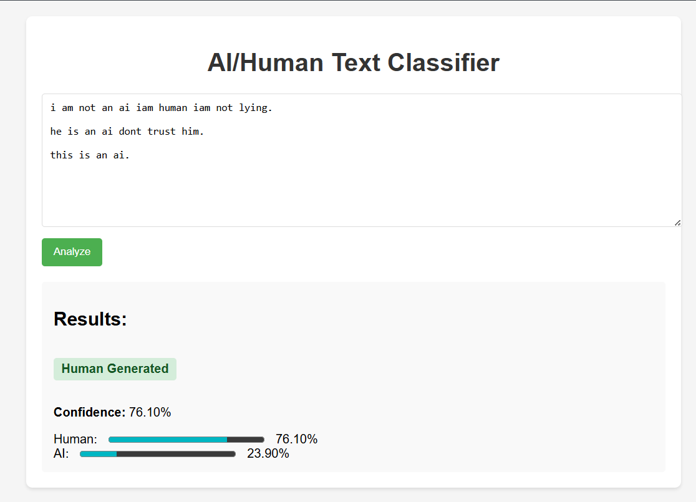
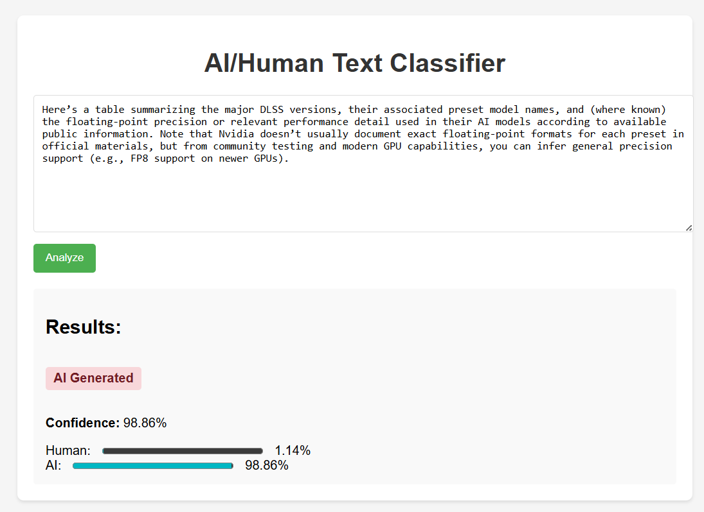

# Human vs. Al Text Discriminator

### Overview
This project is designed to distinguish between human-written and AI-generated text. It leverages advanced machine learning techniques to analyze and classify text inputs, providing insights into the origin of the content.
  

### Tech Stack
`Python` | `torch` | `sklearn` | `transformers` | `numpy` | `pandas` |`matplotlib` | `PIL`| `fastapi`

### Repository Structure
text-classifier-api
├── app/
│   ├── bert_ai_human_classifier/   → model files
│   ├── dockerfile                              → Docker configuration
│   ├── static/                    				   → static assets (CSS)
│   ├── templates/              			   → HTML templates
│   └── main.py                                  → application entry point
├── Notebooks/                                 → model training, data preparation & exploration
├── inference/                                    → screenshots form the web page
├── README.md
└── requirements.txt

### 📊 Results
#### I created a fast api interface with a web page to run the project.

#### And created a Docker configuration file to containerize the project to run on k8n or any cloud, or even a local pc

#### Below are sample outputs from the web page :

| Results |
|--------------|------------------|
|  |  |


**Final Training Metrics:**
- Training Loss: 0.039200
- Validation Loss: 0.097439 
- Precision: 0.99
- Recall: 0.97
- F1-Score: 0.98

### How to Run

1. **Clone the repository**

  ```bash
  git clone https://github.com/beshoyhakeem/Human-vs.-AI-Text-Discriminator-with-api-deployment-.git
  cd text-classifier-api
  cd app
  ```

2. **Install dependencies**

  ```bash
  pip install -r requirements.txt
   ```

3. **Run the FastAPI App**
 
  ```bash
uvicorn main:app --host 0.0.0.0 --port 8000 --reload
```


### Future Improvments
1. **Using Speech Recognition**
2. **Adding more data and improve its Quality**
3. **Creating a computer vision model to classify between real images and AI-generated ones.**


### 👤 Author
**Beshoy Hakeem**  
[LinkedIn](https://www.linkedin.com/in/beshoy-fahmy-14a254359/)  
[GITHUB](https://github.com/beshoyhakeem)  
Email: beshoyashraf042@gmail.com